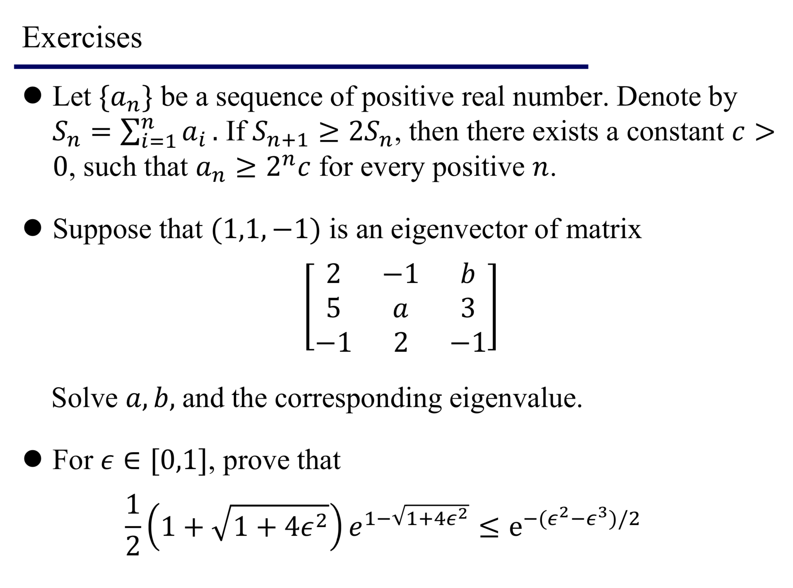
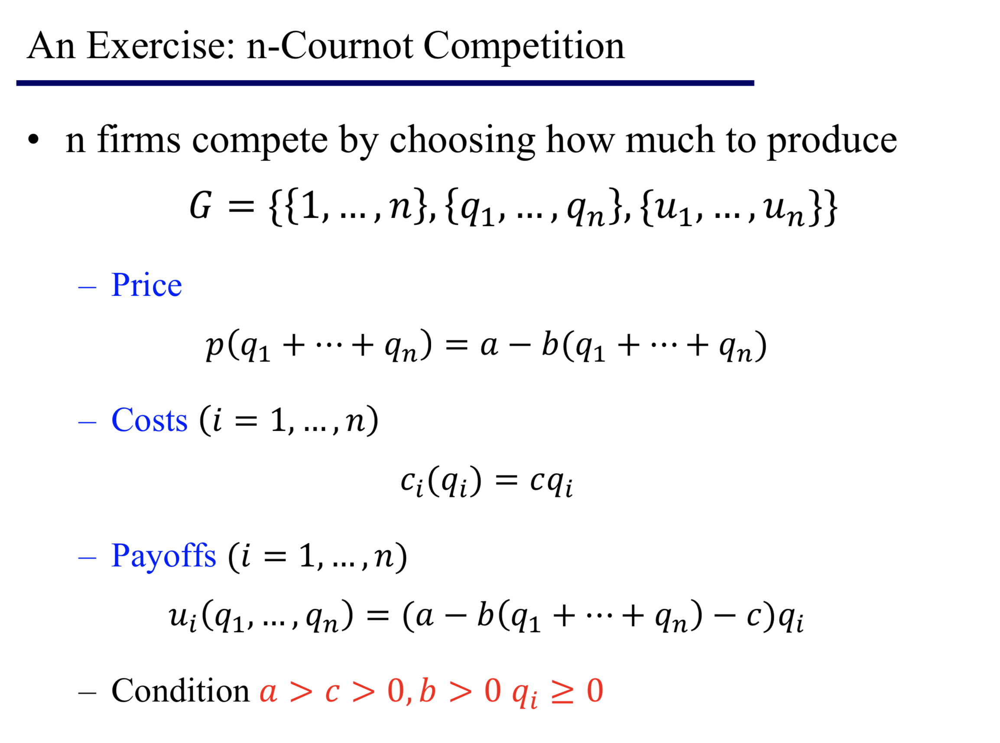
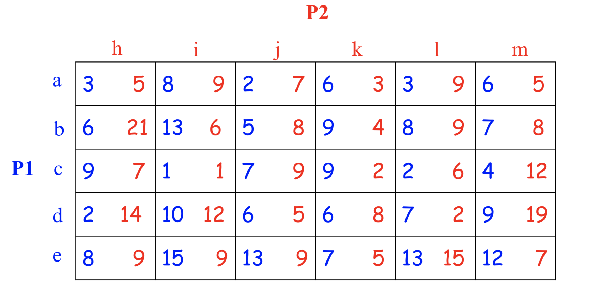
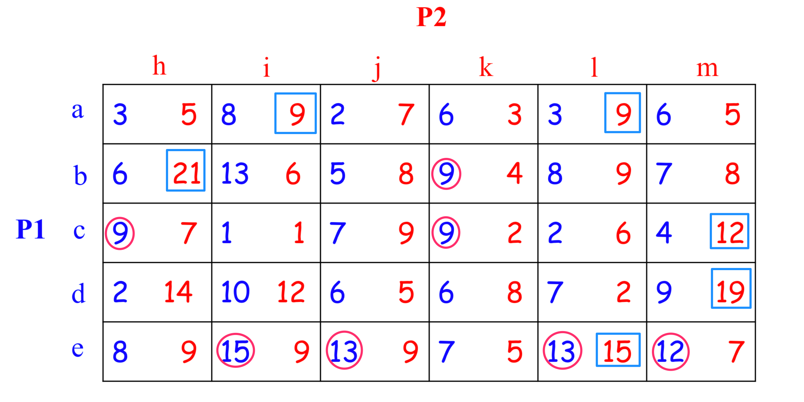

##
GameTheory HomeWork1

###
151220137 许子谦

* Chap0 三选一  
* Chap1 An Exercise: n-Cournot Competition  
* Chap2 两题  
 
---

##Chap0
  

---
####Exercise 1  
由 \\( S\_{n+1} \geq 2S\_n \\)  
得 \\( S\_n+a\_{n+1} \geq 2S\_n \\)  
所以 \\( a\_{n+1} \geq S\_n \\)  

\\( n=1 \\) 时 \\( a\_2\geq S\_1=a\_1 \\)  
\\( n=2 \\) 时 \\( a\_3\geq S\_2=a\_1+a\_2 \geq 2a\_1 \\)  
\\( n=3 \\) 时 \\( a\_4\geq S\_3=S\_2+a\_3 \geq 4a\_1 \\)  
\\( n=4 \\) 时 \\( a\_5\geq S\_4=S\_3+a\_4 \geq 8a\_1 \\)  
...  
推得 \\( a\_{n+1} \geq 2^{n-1}a\_1 \\) 对于\\( n \geq 1 \\)  
即 \\( a\_{n} \geq 2^{n-2}a\_1 \\) 对于\\( n \geq 2 \\)    
所以 \\( c \\) 只需要取 \\( (0,\cfrac{a_1}{4}) \\) 之间的数字即可得到 \\( a\_n \geq 2^nc \\)  
\\( a\_{n+1} \geq 2^{n-1}a\_1 \\)的证明如下：  
\\( a\_{n+1} \geq S\_n \geq a\_n+S\_{n-1} \geq 2S\_{n-1} \geq 2(a\_{n-1}+S\_{n-2}) \geq 4S\_{n-2} \geq ... \geq 2^{n-1}S\_1 = 2^{n-1}a\_1\\)

---
####Exercise 2   
设给出的特征向量为\\(\xi\_1\\)，矩阵为\\(A\\)，有\\(A\xi\_1=\lambda\_1\xi\_1\\)  
$$
 \left[
 \begin{matrix}
   2 & -1 & b \\\
   5 & a & 3 \\\
   -1 & 2 & -1
  \end{matrix}
  \right] 
 \left[
 \begin{matrix}
   1\\\
   1\\\
   -1
  \end{matrix}
  \right]
  =\lambda\_1
   \left[
 \begin{matrix}
   1\\\
   1\\\
   -1
  \end{matrix}
  \right]
$$
解得\\(\lambda\_1=-2, a=-4, b=3\\)  
由
$$
|\lambda E-A|=
 \left|
 \begin{matrix}
   \lambda-2 & 1 & -3 \\\
   -5 & \lambda+4 & -3 \\\
   1 & -2 & \lambda+1
  \end{matrix}
  \right| 
  =(\lambda+2)(\lambda-2)(\lambda+3)=0
 $$
得\\(A\\)的三个特征值为\\(\lambda\_1=-2, \lambda\_2=2, \lambda\_3=-3\\) 

---
####Exercise 3 
由 \\(x+1 \leq e^x\\)  
易得 \\(x \leq e^{x-1}\\)  
易得 \\(\cfrac{1+\sqrt{1+4\epsilon^2}}{2} \leq e^{\cfrac{\sqrt{1+4\epsilon^2}-1}{2}}\\)  
即证 \\(e^{\frac{\sqrt{1+4\epsilon^2}-1}{2}} e^{1-\sqrt{1+4\epsilon^2}} \leq e^{-\frac{\epsilon^2-\epsilon^3}{2}}\\)  
\\(\Leftrightarrow 1-\sqrt{1+4\epsilon^2} \leq \epsilon^3-\epsilon^2\\)  
\\(\Leftrightarrow 1+\epsilon^2-\epsilon^3 \leq \sqrt{1+4\epsilon^2}\\)  
...  
...  

 
  
        
          

##Chap1
  

---
令收益函数的自变量为\\(q\_i\\)，即求一元二次方程最值时的自变量  
\\(f(q\_i)=(a-b(q\_1+...+q\_n)-c)q\_i=(a-c-b\sum\limits_{k\neq i}q\_k)q\_i-bq\_i^2\\)  

对称轴为\\( \cfrac{a-c-b\sum\limits_{k\neq i}q\_k}{2b} \\)，对称轴为负时收益为负不如产量为0  
对称轴为正时在对称轴处取最值  
n个式子连等  

\\( q\_i^*=B\_i(q\_{-i}^{\*})=\cfrac{a-c-b\sum\limits_{k\neq i}q\_k}{2b} \\)

\\(q\_i^{*}\\)都等价

得\\( q\_i^*=\cfrac{a-c}{(n+1)b} \\)  
即\\(NE\\)为\\(\begin{Bmatrix}\left(\cfrac{a-c}{(n+1)b}, \cfrac{a-c}{(n+1)b}, ... , \cfrac{a-c}{(n+1)b}\right)\end{Bmatrix}\\)

##Chap2
###Exercise 1 
###Find all pure strategy Nash equilibria
  
纯策略NE就是找**蓝列最大值**和**红行最大值**  
  
该博弈只有一个纳什均衡 **(e, l)**
###Exercise 2 田忌赛马  
令齐威王的策略分别为 \\( a\_1, a\_2, a\_3, a\_4, a\_5, a\_6 \\)，每个策略对应的概率\\( x\_1, x\_2, x\_3, x\_4, x\_5, x\_6 \\)  
田忌的策略分别为 \\( b\_1, b\_2, b\_3, b\_4, b\_5, b\_6 \\)，每个策略对应的概率\\( y\_1, y\_2, y\_3, y\_4, y\_5, y\_6 \\)  

齐威王各策略的期望收益函数为：  
\\( U\_1(a\_1, p\_2) = 3x\_1 + x\_2 + x\_3 + x\_4 - x\_5 + x\_6 \\)  
\\( U\_1(a\_2, p\_2) = x\_1 + 3x\_2 + x\_3 + x\_4 + x\_5 - x\_6 \\)  
\\( U\_1(a\_3, p\_2) = x\_1 - x\_2 + 3x\_3 + x\_4 + x\_5 + x\_6 \\)  
\\( U\_1(a\_4, p\_2) = -x\_1 + x\_2 + x\_3 + 3x\_4 + x\_5 + x\_6 \\)  
\\( U\_1(a\_5, p\_2) = x\_1 + x\_2 + x\_3 - x\_4 + 3x\_5 + x\_6 \\)  
\\( U\_1(a\_6, p\_2) = x\_1 + x\_2 - x\_3 + x\_4 + x\_5 + 3x\_6 \\)  
混合策略NE就是蓝行皆相等 以上6式子皆相等  
\\(  x\_i \\)都等价，所以都为\\( \frac{1}{6} \\)。同理\\(  y\_i \\)都为\\( \frac{1}{6} \\)。 
不过齐威王各策略的期望收益都为\\(  1 \\)，而田忌各策略的期望收益都为\\(  -1 \\)  
Nash Equilibrium: \\( p=(p\_1, p\_2)=((\cfrac{1}{6}, \cfrac{1}{6}, \cfrac{1}{6}, \cfrac{1}{6}, \cfrac{1}{6}, \cfrac{1}{6}), (\cfrac{1}{6}, \cfrac{1}{6}, \cfrac{1}{6}, \cfrac{1}{6}, \cfrac{1}{6}, \cfrac{1}{6})) \\)